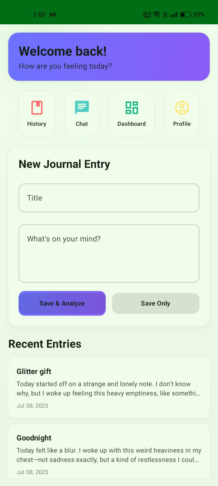
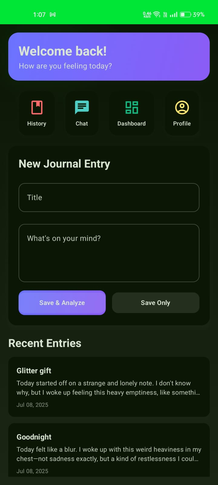
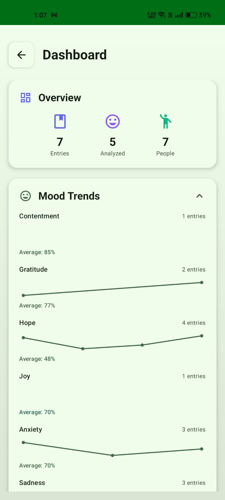
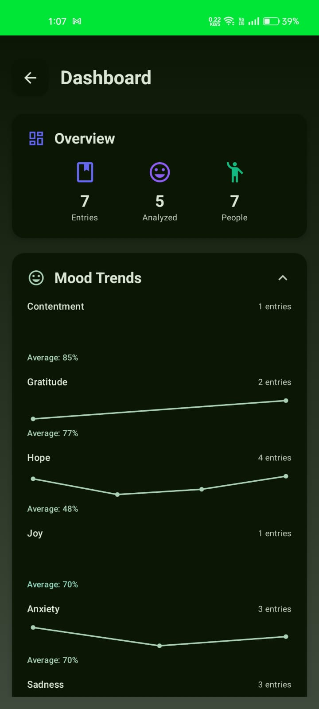
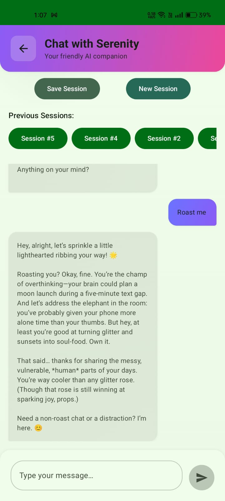
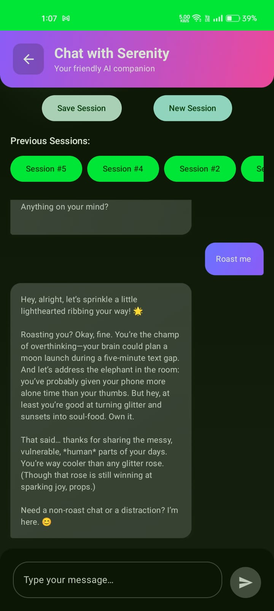
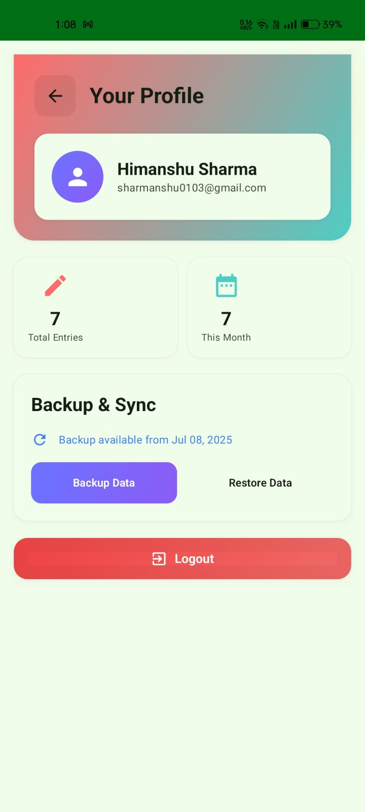
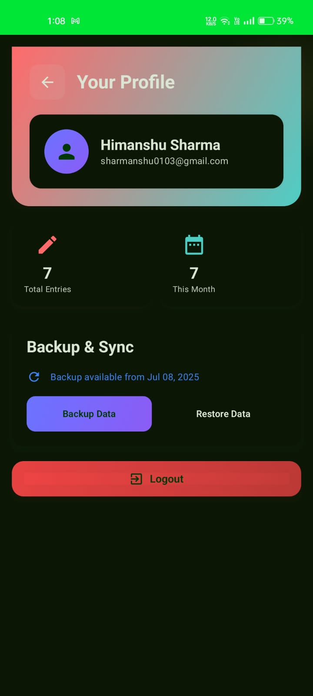

# Serenity-Android

Serenity is a personal wellness companion app designed to help you track your mood, journal your thoughts, and chat for self-reflection. Built with a calming design and privacy in mind, Serenity empowers you to take charge of your mental well-being.

---

## 📥 Download

You can download the latest release of Serenity-Android here:

- **GitHub Release:** [Download APK](https://github.com/Him-anshuSharma/Serenity-App/releases/download/v1.0/app-release.apk)
---

## 🌟 Features

### 1. Effortless Journaling
- Quickly jot down your thoughts and feelings.
- View and edit your journal history.

| Light Theme | Dark Theme |
|-------------|------------|
|  |  |

### 2. Mood Tracking & Dashboard
- Track your mood over time and visualize your progress.
- Dashboard with insights and summaries.

| Light Theme | Dark Theme |
|-------------|------------|
|  |  |

### 3. AI-Powered Chat
- Chat with Serenity for self-reflection and support.

| Light Theme | Dark Theme |
|-------------|------------|
|  |  |

### 4. Secure Data Backup
- Backup and restore your data securely.

| Light Theme | Dark Theme |
|-------------|------------|
|  |  |

---

## 🤝 Contributing

Contributions are welcome! Please open issues or pull requests for suggestions and improvements.

---

## 📄 License

[MIT](LICENSE)

## Secrets & Release Preparation

- **local.properties**: This file contains sensitive data (e.g., Google client ID) and must NOT be committed. Use the provided template and add your own secrets locally.
- **Keystore files**: Never commit your release keystore or passwords. Use local signing configs only.
- **google-services.json**: If present, do not commit real credentials. Use a placeholder for open source or share securely with collaborators.
- **ProGuard**: Rules are included, but do not add secrets to proguard-rules.pro.

### Setting up for Development
1. Copy `local.properties.example` (or the template in this repo) to `local.properties`.
2. Add your real Google client ID and SDK path.
3. Never commit your `local.properties` or keystore files.

### Preparing for Release
- Double-check that no secrets are hardcoded in the codebase.
- Ensure all sensitive files are in `.gitignore`.
- Build with ProGuard enabled for release.
